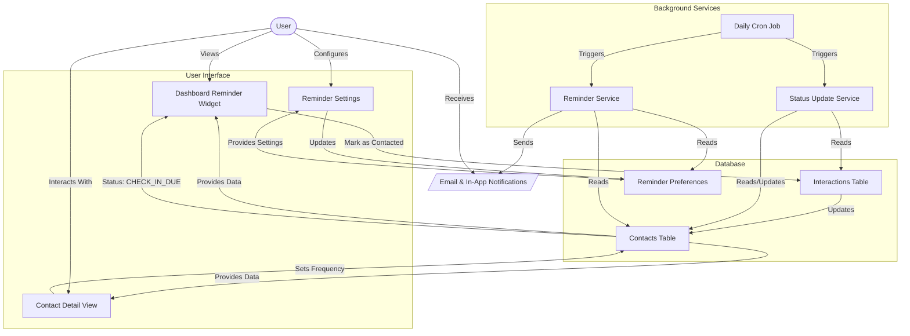
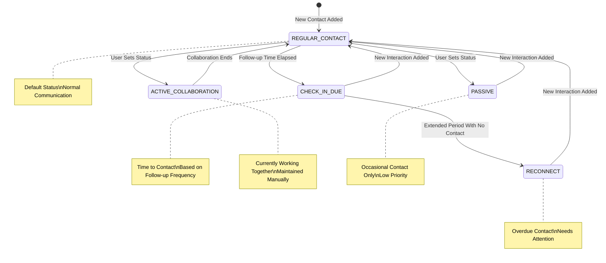

# Reminder System Implementation Guide

## Overview

The Reminder System is a core component of the Developer Hub CRM,
designed to ensure that developers never lose touch with important
connections. This system helps users maintain relationships over time
by tracking when they last contacted someone and providing
notifications for when they should reach out next.

Unlike generic CRMs, our reminder system is specifically tailored for
developer networking needs, with specialized status tracking and
customizable follow-up schedules based on relationship importance.

## System Architecture



## Status Workflow



## User Experience

1. **Status Tracking**:

   - Each contact has a visible status indicating the health of the
     relationship
   - Status updates automatically based on interaction history and
     configured rules
   - Visual indicators show which contacts need attention at a glance

2. **Follow-up Schedules**:

   - Users can set custom follow-up frequencies for different contacts
     based on importance
   - VIP contacts can have more frequent check-in requirements
   - Conference/event contacts have special follow-up timing

3. **Dashboard Notifications**:

   - Overview of contacts requiring attention
   - Upcoming follow-ups organized by urgency
   - Historical view of relationship maintenance

4. **Automated Status Changes**:
   - System automatically updates contact status based on last
     interaction date
   - Rules consider the contact's importance level and relationship
     type

## Technical Implementation

### 1. Enhanced Contact Status System

```typescript
// Status options in the schema
export enum ContactStatus {
	ACTIVE_COLLABORATION = 'active_collaboration', // Currently working together
	REGULAR_CONTACT = 'regular_contact', // In regular communication
	CHECK_IN_DUE = 'check_in_due', // Time to reach out
	RECONNECT = 'reconnect', // Haven't spoken in a while
	PASSIVE = 'passive', // Occasional contact only
}

// Extended contact schema with follow-up preferences
export const contact = sqliteTable('contact', {
	// Existing fields...
	status: text('status').notNull().default('regular_contact'),
	lastContacted: integer('last_contacted', { mode: 'timestamp_ms' }),
	followUpFrequency: integer('follow_up_frequency')
		.notNull()
		.default(30), // days
	importanceLevel: integer('importance_level').notNull().default(1), // 1-5 scale
	nextFollowUpDate: integer('next_follow_up_date', {
		mode: 'timestamp_ms',
	}),
	// ...
});

// New table for reminder preferences
export const reminderPreferences = sqliteTable(
	'reminder_preferences',
	{
		id: text('id').primaryKey(),
		userId: text('user_id')
			.notNull()
			.references(() => user.id),
		defaultFollowUpFrequency: integer('default_follow_up_frequency')
			.notNull()
			.default(30),
		vipFollowUpFrequency: integer('vip_follow_up_frequency')
			.notNull()
			.default(14),
		emailReminders: integer('email_reminders', { mode: 'boolean' })
			.notNull()
			.default(true),
		inAppReminders: integer('in_app_reminders', { mode: 'boolean' })
			.notNull()
			.default(true),
		reminderLeadTime: integer('reminder_lead_time')
			.notNull()
			.default(2), // days before due
		weekendReminders: integer('weekend_reminders', {
			mode: 'boolean',
		})
			.notNull()
			.default(false),
		...timestamps,
	},
);
```

### 2. Status Update Service

```typescript
// src/lib/server/services/statusUpdate.ts
import { eq, lt, and, sql } from 'drizzle-orm';
import { db } from '$lib/server/db';
import { contact, ContactStatus } from '$lib/server/db/schema';

export async function updateContactStatuses() {
	const now = Date.now();

	// Get all contacts that need status updates
	const contacts = await db.query.contact.findMany();

	for (const c of contacts) {
		let newStatus = c.status;
		const daysSinceLastContact = c.lastContacted
			? Math.floor((now - c.lastContacted) / (1000 * 60 * 60 * 24))
			: null;

		// Calculate suggested status based on follow-up frequency and importance
		if (!c.lastContacted) {
			// Never contacted
			newStatus = ContactStatus.CHECK_IN_DUE;
		} else if (daysSinceLastContact > c.followUpFrequency * 3) {
			// Way overdue
			newStatus = ContactStatus.RECONNECT;
		} else if (daysSinceLastContact > c.followUpFrequency) {
			// Due for check-in
			newStatus = ContactStatus.CHECK_IN_DUE;
		} else if (c.status === 'active_collaboration') {
			// Preserve active collaboration status
			newStatus = ContactStatus.ACTIVE_COLLABORATION;
		} else {
			// Regular contact
			newStatus = ContactStatus.REGULAR_CONTACT;
		}

		// Update if status has changed
		if (newStatus !== c.status) {
			await db
				.update(contact)
				.set({
					status: newStatus,
					updated_at: now,
				})
				.where(eq(contact.id, c.id));
		}

		// Calculate next follow-up date if it doesn't exist
		if (!c.nextFollowUpDate && c.lastContacted) {
			const nextFollowUp =
				c.lastContacted + c.followUpFrequency * 24 * 60 * 60 * 1000;
			await db
				.update(contact)
				.set({
					nextFollowUpDate: nextFollowUp,
					updated_at: now,
				})
				.where(eq(contact.id, c.id));
		}
	}
}
```

### 3. Dashboard Reminder Component

```svelte
<!-- src/routes/dashboard/components/ReminderPanel.svelte -->
<script lang="ts">
	import { onMount } from 'svelte';
	import { formatDistanceToNow } from 'date-fns';
	import { contactState } from '$lib/state/contacts.svelte.ts';

	let checkInDue = $state([]);
	let reconnect = $state([]);
	let upcomingFollowUps = $state([]);

	$effect(() => {
		// When contacts are loaded, filter them by status
		if (contactState.contacts.length > 0) {
			checkInDue = contactState.contacts.filter(
				(c) => c.status === 'check_in_due',
			);
			reconnect = contactState.contacts.filter(
				(c) => c.status === 'reconnect',
			);

			// Get contacts with upcoming follow-ups in the next 7 days
			const now = Date.now();
			const oneWeekFromNow = now + 7 * 24 * 60 * 60 * 1000;
			upcomingFollowUps = contactState.contacts
				.filter(
					(c) =>
						c.nextFollowUpDate &&
						c.nextFollowUpDate > now &&
						c.nextFollowUpDate < oneWeekFromNow,
				)
				.sort((a, b) => a.nextFollowUpDate - b.nextFollowUpDate);
		}
	});

	function getStatusClass(status) {
		switch (status) {
			case 'check_in_due':
				return 'bg-warning';
			case 'reconnect':
				return 'bg-error';
			case 'active_collaboration':
				return 'bg-success';
			case 'regular_contact':
				return 'bg-info';
			default:
				return 'bg-neutral';
		}
	}
</script>

<div class="card bg-base-200">
	<div class="card-body">
		<h2 class="card-title">Relationship Maintenance</h2>

		{#if checkInDue.length > 0 || reconnect.length > 0}
			<div class="mb-4">
				<h3 class="text-lg font-semibold">Needs Attention</h3>
				<div class="divide-y">
					{#each [...reconnect, ...checkInDue] as contact}
						<div class="flex items-center justify-between py-2">
							<div>
								<div class="font-medium">{contact.name}</div>
								<div class="text-sm opacity-70">
									{contact.lastContacted
										? `Last contact: ${formatDistanceToNow(contact.lastContacted)} ago`
										: 'Never contacted'}
								</div>
							</div>
							<div class="flex gap-2">
								<span class="badge {getStatusClass(contact.status)}">
									{contact.status.replace('_', ' ')}
								</span>
								<a href="/contacts/{contact.id}" class="btn btn-sm"
									>View</a
								>
							</div>
						</div>
					{/each}
				</div>
			</div>
		{/if}

		{#if upcomingFollowUps.length > 0}
			<div>
				<h3 class="text-lg font-semibold">Upcoming Follow-ups</h3>
				<div class="divide-y">
					{#each upcomingFollowUps as contact}
						<div class="flex items-center justify-between py-2">
							<div>
								<div class="font-medium">{contact.name}</div>
								<div class="text-sm opacity-70">
									Follow-up due: {formatDistanceToNow(
										contact.nextFollowUpDate,
										{ addSuffix: true },
									)}
								</div>
							</div>
							<a href="/contacts/{contact.id}" class="btn btn-sm"
								>View</a
							>
						</div>
					{/each}
				</div>
			</div>
		{/if}

		{#if checkInDue.length === 0 && reconnect.length === 0 && upcomingFollowUps.length === 0}
			<div class="alert alert-success">
				<svg
					xmlns="http://www.w3.org/2000/svg"
					class="h-6 w-6 shrink-0 stroke-current"
					fill="none"
					viewBox="0 0 24 24"
					><path
						stroke-linecap="round"
						stroke-linejoin="round"
						stroke-width="2"
						d="M9 12l2 2 4-4m6 2a9 9 0 11-18 0 9 9 0 0118 0z"
					/></svg
				>
				<span>You're up to date with all your relationships!</span>
			</div>
		{/if}
	</div>
</div>
```

### 4. Contact Detail Reminder UI

```svelte
<!-- src/routes/contacts/[id]/components/FollowUpSettings.svelte -->
<script lang="ts">
  import { enhance } from '$app/forms';

  export let contact;

  let frequency = $state(contact.followUpFrequency || 30);
  let importance = $state(contact.importanceLevel || 1);

  $effect(() => {
    if (contact) {
      frequency = contact.followUpFrequency || 30;
      importance = contact.importanceLevel || 1;
    }
  });

  function getImportanceLabel(level) {
    switch(level) {
      case 1: return "Low";
      case 2: return "Medium-Low";
      case 3: return "Medium";
      case 4: return "Medium-High";
      case 5: return "High";
      default: return "Medium";
    }
  }
</script>

<div class="card bg-base-200 mb-4">
  <div class="card-body">
    <h3 class="card-title">Follow-up Settings</h3>

    <form method="POST" action="?/updateFollowUp" use:enhance>
      <div class="form-control mb-4">
        <label class="label" for="importance">
          <span class="label-text">Importance Level</span>
          <span class="label-text-alt">{getImportanceLabel(importance)}</span>
        </label>
        <input
          type="range"
          min="1"
          max="5"
          class="range"
          step="1"
          name="importanceLevel"
          value={importance}
          bind:value={importance}
        />
        <div class="w-full flex justify-between text-xs px-2">
          <span>|</span>
          <span>|</span>
          <span>|</span>
          <span>|</span>
          <span>|</span>
        </div>
      </div>

      <div class="form-control mb-4">
        <label class="label" for="frequency">
          <span class="label-text">Follow-up Frequency</span>
          <span class="label-text-alt">{frequency} days</span>
        </label>
        <input
          type="range"
          min="7"
          max="180"
          class="range"
          step="1"
          name="followUpFrequency"
          value={frequency}
          bind:value={frequency}
        />
        <div class="w-full flex justify-between text-xs px-2">
          <span>Weekly</span>
          <span>Monthly</span>
          <span>Quarterly</span>
          <span>Biannual</span>
        </div>
      </div>

      <div class="form-control">
        <label class="label cursor-pointer">
          <span class="label-text">Reset follow-up timer when adding interactions</span>
          <input type="checkbox" name="resetOnInteraction" checked class="checkbox" />
        </label>
      </div>

      <button type="submit" class="btn btn-primary w-full mt-4">Save Follow-up Settings</button>
    </form>

    {#if contact.nextFollowUpDate}
      <div class="alert mt-4 {Date.now() > contact.nextFollowUpDate ? 'alert-warning' : 'alert-info'}">
        <svg xmlns="http://www.w3.org/2000/svg" fill="none" viewBox="0 0 24 24" class="stroke-current shrink-0 w-6 h-6"><path stroke-linecap="round" stroke-linejoin="round" stroke-width="2" d="M13 16h-1v-4h-1m1-4h.01M21 12a9 9 0 11-18 0 9 9 0 0118 0z"></path></svg>
        <div>
          <div class="font-medium">Next follow-up:</div>
          <div>{new Date(contact.nextFollowUpDate).toLocaleDateString()}</div>
        </div>
      </div>
    {/if}
  </div>
</div>
```

### 5. Server-side Reminder Logic

```typescript
// src/routes/contacts/[id]/+page.server.ts (extended with follow-up actions)
export const actions = {
	// ... existing actions

	updateFollowUp: async ({ request, params }) => {
		const { id } = params;
		const data = await request.formData();

		const importanceLevel = parseInt(
			data.get('importanceLevel')?.toString() || '3',
		);
		const followUpFrequency = parseInt(
			data.get('followUpFrequency')?.toString() || '30',
		);
		const resetOnInteraction =
			data.get('resetOnInteraction') === 'on';

		// Calculate next follow-up date based on last contacted date
		const contactData = await db.query.contact.findFirst({
			where: eq(contact.id, id),
		});

		if (!contactData) {
			return { success: false, error: 'Contact not found' };
		}

		let nextFollowUpDate = null;
		if (contactData.lastContacted) {
			nextFollowUpDate =
				contactData.lastContacted +
				followUpFrequency * 24 * 60 * 60 * 1000;
		}

		try {
			await db
				.update(contact)
				.set({
					importanceLevel,
					followUpFrequency,
					nextFollowUpDate,
					updated_at: Date.now(),
				})
				.where(eq(contact.id, id));

			return { success: true };
		} catch (error) {
			console.error('Error updating follow-up settings:', error);
			return {
				success: false,
				error: 'Failed to update follow-up settings',
			};
		}
	},

	markContacted: async ({ params }) => {
		const { id } = params;
		const now = Date.now();

		try {
			// Get current follow-up frequency
			const contactData = await db.query.contact.findFirst({
				where: eq(contact.id, id),
			});

			if (!contactData) {
				return { success: false, error: 'Contact not found' };
			}

			// Calculate next follow-up date
			const nextFollowUpDate =
				now + contactData.followUpFrequency * 24 * 60 * 60 * 1000;

			// Update lastContacted and status
			await db
				.update(contact)
				.set({
					lastContacted: now,
					status: 'regular_contact',
					nextFollowUpDate,
					updated_at: now,
				})
				.where(eq(contact.id, id));

			return { success: true };
		} catch (error) {
			console.error('Error marking contact as contacted:', error);
			return {
				success: false,
				error: 'Failed to update contact status',
			};
		}
	},
};
```

### 6. Scheduled Status Updates

```typescript
// src/lib/server/cron.ts
import { updateContactStatuses } from '$lib/server/services/statusUpdate';
import { sendFollowUpReminders } from '$lib/server/services/reminders';

// This would be triggered by a cron job, or serverless function
export async function dailyMaintenanceTasks() {
	// Update all contact statuses
	await updateContactStatuses();

	// Send reminder emails/notifications
	await sendFollowUpReminders();
}
```

## Implementation Benefits

1. **Core CRM Functionality**: Addresses the primary function of a
   CRM - maintaining relationships
2. **Developer-Focused**: Customized for technical networking with
   specific status types
3. **Immediate Value**: Provides value even for existing contacts,
   unlike Quick Connect
4. **Leverages Existing Data**: Uses the `status` and `last_contacted`
   fields already in the schema
5. **Visual Prioritization**: Helps users quickly identify which
   contacts need attention

## User Interface Components

1. **Dashboard Reminder Widget**: Shows contacts needing attention and
   upcoming follow-ups
2. **Contact Card Status Indicators**: Visual badges showing
   relationship health
3. **Follow-up Settings Form**: Allows customizing follow-up frequency
   per contact
4. **Status Timeline**: Shows history of status changes and
   interactions
5. **Quick Actions**: One-click buttons to mark as contacted or
   schedule follow-up

## Best Practices for Reminder System

1. **Balance Automation with Control**: Automate status changes but
   let users override
2. **Use Visual Cues**: Color-code statuses for quick identification
3. **Respect Frequency Preferences**: Different relationships need
   different cadences
4. **Provide Context**: Show last interaction details with reminders
5. **Keep It Simple**: Focus on actionable information to avoid
   overwhelming users

## Future Enhancements

1. **Email Notifications**: Send reminders to user's email
2. **Calendar Integration**: Add follow-ups to user's calendar
3. **Smart Follow-up Suggestions**: Suggest topics based on previous
   interactions
4. **Bulk Follow-up Actions**: Manage multiple follow-ups at once
5. **Follow-up Templates**: Pre-written messages for different
   follow-up scenarios

## Integration with Other Features

The reminder system integrates with several other planned features:

1. **Quick Connect**: New contacts added via Quick Connect can have
   automatic follow-up schedules
2. **Interaction Tracking**: New interactions should reset the
   follow-up timer
3. **VIP Features**: VIP contacts can have priority in the reminder
   system
4. **Dashboard**: Reminder widgets provide key relationship insights
5. **AI Features**: Future AI suggestions can include follow-up
   content based on history
