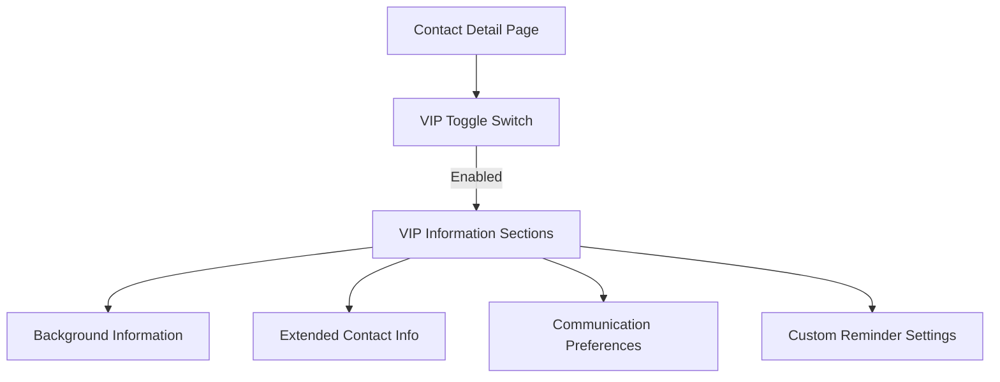

# VIP Features in Developer Hub CRM

## What is the VIP Feature?

The VIP (Very Important Person) feature in Developer Hub CRM is a
specialized system for designating and managing high-value
professional relationships. It allows developers to flag certain
contacts as particularly important and maintain more detailed
information about them.

## Why Have VIP Contacts?

In professional networking, not all contacts have equal importance or
require the same level of relationship management. The VIP designation
helps developers:

1. **Prioritize Key Relationships**: Identify which professional
   connections are most valuable to maintain
2. **Store More Context**: Keep detailed notes about important
   contacts' preferences, background, and history
3. **Customize Follow-up Frequency**: Set more frequent reminders for
   high-value connections
4. **Track Extended Information**: Store information that would be
   excessive for regular contacts

## Types of VIP Contacts for Developers

1. **Mentors**: Senior developers who provide guidance and career
   advice
2. **Collaborators**: Frequent project partners on open-source or
   professional work
3. **Domain Experts**: Specialists with deep knowledge in particular
   technologies
4. **Industry Connectors**: People who can make introductions to
   opportunities
5. **Potential Employers/Clients**: Decision-makers who might hire you
   or contract your services

## Technical Implementation

The VIP feature is implemented through several database tables and UI
components:

### Database Schema

The system uses two additional tables for storing VIP-specific
information:

1. **Background Table**:

   ```typescript
   export const background = sqliteTable('background', {
   	id: text('id').primaryKey(),
   	contactId: text('contact_id')
   		.notNull()
   		.references(() => contact.id),
   	family: text('family'),
   	company: text('company'),
   	likesDislikes: text('likes_dislikes'),
   	miscNotes: text('misc_notes'),
   	...timestamps,
   });
   ```

2. **Contact Info Table**:
   ```typescript
   export const contactInfo = sqliteTable('contact_info', {
   	id: text('id').primaryKey(),
   	contactId: text('contact_id')
   		.notNull()
   		.references(() => contact.id),
   	mainApp: text('main_app'),
   	email: text('email'),
   	phoneNumber: text('phone_number'),
   	socialLinks: text('social_links'),
   	...timestamps,
   });
   ```

### UI Components

1. **VIP Toggle**: A simple switch on the contact detail page to mark
   a contact as VIP
2. **Extended Profile Sections**: Additional UI components that appear
   when a contact is marked as VIP
3. **VIP Dashboard**: A specialized view showing all VIP contacts with
   their follow-up status
4. **VIP Indicators**: Visual markers in contact lists highlighting
   VIP status

## Integration with Reminder System

VIP contacts integrate with the reminder system in these key ways:

1. **Priority in Dashboard**: VIP contacts appear at the top of
   reminder lists
2. **Customizable Follow-up Frequency**: Default to more frequent
   check-ins (14 days vs 30)
3. **Enhanced Notifications**: More prominent reminders for VIP
   follow-ups
4. **Status Sensitivity**: Status changes more quickly to "Check-in
   Due" for VIPs

## User Experience

### Adding VIP Information

When a contact is marked as VIP, additional form sections appear:

1. **Background Information**:

   - Family details (for remembering personal contexts)
   - Company information
   - Likes/dislikes (for personalized interactions)
   - Miscellaneous notes

2. **Extended Contact Information**:
   - Preferred communication app
   - Email (if not already captured)
   - Phone number
   - Social media links

### VIP Contact Experience

The system provides a more comprehensive view of VIP contacts:



## Benefits of VIP Feature for Developers

1. **Relationship Quality**: Remember important details about key
   contacts to maintain stronger connections
2. **Customized Follow-ups**: Set personalized reminder schedules
   based on relationship importance
3. **Contextual Information**: Have all relevant personal and
   professional details at hand when interacting
4. **Memory Extension**: Offload the mental burden of remembering
   important details about many people
5. **Professional Edge**: Demonstrate attentiveness and care in
   important professional relationships

## Implementation Status

The VIP feature is currently partially implemented:

- ✅ Database schema for VIP information
- ✅ Basic VIP toggle in UI
- ✅ VIP information display (when available)
- ❌ VIP information editing UI
- ❌ Comprehensive VIP dashboard
- ❌ VIP activation/deactivation with data preservation

## Next Steps

1. Add UI components for editing background information
2. Create forms for managing extended contact information
3. Implement comprehensive VIP dashboard for quick access
4. Add VIP activation/deactivation functionality that preserves data
5. Integrate VIP priority into the reminder system
