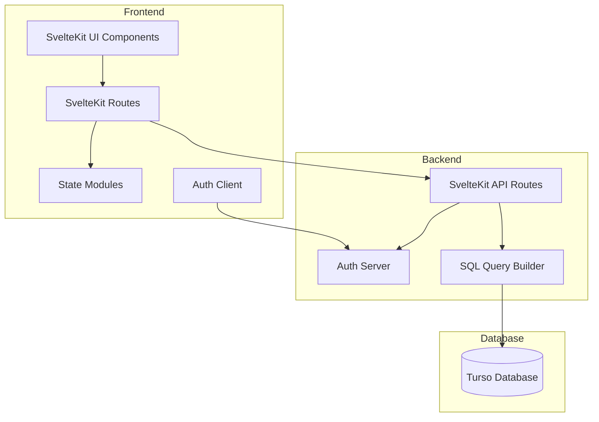

# Developer Hub CRM Plan

## Architecture Overview



## Key Components

1. **Database Layer**

   - Turso for distributed SQLite database
   - Raw SQL queries for maximum flexibility
   - SQL query builder utility for type safety
   - Schema management with SQL migrations

2. **Authentication System**

   - Custom JWT-based authentication
   - Secure password hashing
   - Session management
   - CSRF protection
   - Role-based access control

3. **Frontend Architecture**

   - SvelteKit with Svelte 5 runes
   - Modern state management with .svelte.ts files
   - Tailwind v4 for styling
   - DaisyUI v5 for UI components
   - Responsive design for mobile and desktop
   - Dark/light mode support

4. **API Layer**
   - RESTful API endpoints
   - Type-safe request/response handling
   - Error handling and validation
   - Rate limiting

## Data Model

### Core Entities

#### Users

- `id` (TEXT, PRIMARY KEY)
- `email` (TEXT, UNIQUE)
- `name` (TEXT)
- `password_hash` (TEXT)
- `created_at` (TIMESTAMP)
- `updated_at` (TIMESTAMP)

#### Contacts

- `id` (TEXT, PRIMARY KEY)
- `user_id` (TEXT, FOREIGN KEY)
- `name` (TEXT)
- `relationship` (TEXT)
- `birthday` (DATE, nullable)
- `industry` (TEXT)
- `location` (TEXT, nullable)
- `vip` (BOOLEAN)
- `last_update` (TIMESTAMP)
- `last_contacted` (DATE, nullable)
- `status` (TEXT)
- `created_at` (TIMESTAMP)
- `updated_at` (TIMESTAMP)

#### Interactions

- `id` (TEXT, PRIMARY KEY)
- `contact_id` (TEXT, FOREIGN KEY)
- `type` (TEXT)
- `date` (DATE)
- `notes` (TEXT)
- `created_at` (TIMESTAMP)
- `updated_at` (TIMESTAMP)

#### Background (for VIPs)

- `id` (TEXT, PRIMARY KEY)
- `contact_id` (TEXT, FOREIGN KEY)
- `family` (TEXT, nullable)
- `company` (TEXT, nullable)
- `likes_dislikes` (TEXT, nullable)
- `misc_notes` (TEXT, nullable)
- `created_at` (TIMESTAMP)
- `updated_at` (TIMESTAMP)

#### ContactInfo (for VIPs)

- `id` (TEXT, PRIMARY KEY)
- `contact_id` (TEXT, FOREIGN KEY)
- `main_app` (TEXT, nullable)
- `email` (TEXT, nullable)
- `phone_number` (TEXT, nullable)
- `social_links` (TEXT, nullable) // JSON stored as TEXT
- `created_at` (TIMESTAMP)
- `updated_at` (TIMESTAMP)

## Implementation Plan

### Phase 1: Foundation

1. **Project Setup**

   - ✅ Initialize SvelteKit project
   - ✅ Configure Tailwind v4 and DaisyUI v5 (basic setup)
   - ✅ Set up Turso database connection
   - ⚠️ Create SQL migration system (partially implemented with Drizzle)
   - ❌ Implement base layout and navigation

2. **Authentication System**
   - ✅ Implement user registration and login (demo implementation with Lucia patterns)
   - ✅ Create JWT token generation and validation
   - ✅ Set up secure password hashing (using Argon2)
   - ✅ Develop session management
   - ⚠️ Add authentication guards for routes (implemented for demo only)

### Phase 2: Core Features

1. **Contact Management**

   - ✅ Create contact CRUD operations
   - ✅ Implement contact listing with filtering and sorting
   - ✅ Develop contact detail view
   - ⚠️ Add VIP functionality
   - ❌ Create contact search

2. **Interaction Tracking**

   - ✅ Implement interaction CRUD operations
   - ✅ Create interaction history view
   - ⚠️ Add interaction filtering
   - ❌ Develop notes functionality

3. **VIP Features**
   - ❌ Implement extended profile for VIPs
   - ❌ Create background information section
   - ❌ Develop contact information section
   - ❌ Add VIP dashboard view

### Phase 3: Advanced Features

1. **Reminder System**

   - ❌ Implement follow-up reminders
   - ❌ Create status tracking
   - ❌ Develop notification system
   - ❌ Add email notifications

2. **Dashboard**

   - ❌ Create overview dashboard
   - ❌ Implement contact status visualization
   - ❌ Add recent interactions display
   - ❌ Develop VIP quick access

3. **Mobile Optimization**
   - ❌ Ensure responsive design
   - ❌ Optimize for touch interfaces
   - ❌ Implement progressive enhancement
   - ❌ Add offline capabilities

## Folder Structure

```
/
├── src/
│   ├── lib/
│   │   ├── components/
│   │   │   ├── ui/            # Reusable UI components
│   │   │   ├── contacts/      # Contact-related components
│   │   │   ├── interactions/  # Interaction-related components
│   │   │   └── dashboard/     # Dashboard components
│   │   ├── server/
│   │   │   ├── db/
│   │   │   │   ├── migrations/  # SQL migrations
│   │   │   │   └── queries/     # SQL query functions
│   │   │   ├── auth/          # Authentication logic
│   │   │   └── api/           # API utilities
│   │   ├── state/             # State modules (.svelte.ts files)
│   │   ├── types/             # TypeScript type definitions
│   │   └── utils/             # Utility functions
│   ├── routes/
│   │   ├── api/               # API endpoints
│   │   ├── auth/              # Auth routes (login, register)
│   │   ├── contacts/          # Contact management routes
│   │   ├── interactions/      # Interaction management routes
│   │   └── dashboard/         # Dashboard routes
│   ├── app.html               # HTML template
│   └── app.css                # Global styles
├── static/                    # Static assets
├── migrations/                # Database migrations
├── tests/                     # Test files
└── scripts/                   # Utility scripts
```

## Technical Approach

### Database Access

Instead of using an ORM like Drizzle, we'll implement a lightweight
SQL query builder that provides:

1. Type safety for queries and results
2. SQL injection protection
3. Transaction support
4. Connection pooling

Example implementation:

```typescript
// src/lib/server/db/index.ts
import { createClient } from '@libsql/client';

const client = createClient({
	url: process.env.DATABASE_URL || 'file:local.db',
});

export async function query<T>(
	sql: string,
	params: Record<string, any> = {},
): Promise<T[]> {
	const result = await client.execute({ sql, args: params });
	return result.rows as T[];
}

export async function queryOne<T>(
	sql: string,
	params: Record<string, any> = {},
): Promise<T | null> {
	const results = await query<T>(sql, params);
	return results[0] || null;
}

export async function execute(
	sql: string,
	params: Record<string, any> = {},
): Promise<{ rowsAffected: number }> {
	const result = await client.execute({ sql, args: params });
	return { rowsAffected: result.rowsAffected };
}

export async function transaction<T>(
	callback: (tx: typeof client) => Promise<T>,
): Promise<T> {
	return client.transaction(callback);
}
```

### Authentication

We'll implement a custom JWT-based authentication system:

1. Generate secure JWT tokens with appropriate expiration
2. Store hashed passwords using Argon2
3. Implement refresh token rotation for security
4. Add CSRF protection for forms

Example JWT implementation:

```typescript
// src/lib/server/auth/jwt.ts
import { SignJWT, jwtVerify } from 'jose';

const secret = new TextEncoder().encode(process.env.JWT_SECRET);

export async function createToken(
	payload: any,
	expiresIn: string = '15m',
) {
	return await new SignJWT(payload)
		.setProtectedHeader({ alg: 'HS256' })
		.setIssuedAt()
		.setExpirationTime(expiresIn)
		.sign(secret);
}

export async function verifyToken(token: string) {
	try {
		const { payload } = await jwtVerify(token, secret);
		return payload;
	} catch (error) {
		return null;
	}
}
```

### Frontend Components and State Management

#### Component-Level State

Using Svelte 5's runes for component-level state management:

```svelte
<!-- src/lib/components/contacts/ContactList.svelte -->
<script>
  let { contacts } = $props();
  let searchTerm = $state('');
  
  $derived filteredContacts = contacts.filter(contact => 
    contact.name.toLowerCase().includes(searchTerm.toLowerCase())
  );
</script>

<div class="search-container">
	<input
		type="text"
		placeholder="Search contacts..."
		bind:value={searchTerm}
	/>
</div>

<div class="contacts-grid">
	{#each filteredContacts as contact}
		<ContactCard {contact} />
	{/each}
</div>
```

#### Global State Management

For global state, we'll use the modern approach with `.svelte.ts`
files:

```typescript
// src/lib/state/contacts.svelte.ts
export const contacts = $state({
	items: [],
	loading: false,
	error: null,
});

// Functions to manipulate state
export function addContact(contact) {
	contacts.items = [...contacts.items, contact];
}

export function removeContact(id) {
	contacts.items = contacts.items.filter(
		(contact) => contact.id !== id,
	);
}

export function setLoading(isLoading) {
	contacts.loading = isLoading;
}

export function setError(error) {
	contacts.error = error;
}
```

Using the global state in components:

```svelte
<!-- src/routes/contacts/+page.svelte -->
<script>
	import {
		contacts,
		addContact,
		setLoading,
	} from '$lib/state/contacts.svelte';
	import ContactForm from '$lib/components/contacts/ContactForm.svelte';
	import ContactList from '$lib/components/contacts/ContactList.svelte';

	async function handleAddContact(event) {
		setLoading(true);
		try {
			const newContact = event.detail;
			await fetch('/api/contacts', {
				method: 'POST',
				body: JSON.stringify(newContact),
				headers: {
					'Content-Type': 'application/json',
				},
			});
			addContact(newContact);
		} catch (error) {
			console.error('Failed to add contact:', error);
		} finally {
			setLoading(false);
		}
	}
</script>

<h1>Contacts</h1>

<ContactForm on:add={handleAddContact} />

{#if contacts.loading}
	<div class="loading">Loading...</div>
{:else if contacts.error}
	<div class="error">{contacts.error}</div>
{:else}
	<ContactList contacts={contacts.items} />
{/if}
```

## Best Practices

1. **State Management**

   - Use `.svelte.ts` files for global state
   - Be cautious with global state in isomorphic applications
     (server/client)
   - Consider using Svelte Kit's context system for server-rendered
     state
   - Keep state modules focused on specific domains (contacts,
     interactions, etc.)
   - Provide clear functions for state manipulation rather than direct
     access

2. **Security**

   - Implement proper authentication and authorization
   - Use prepared statements for all SQL queries
   - Apply CSRF protection for forms
   - Validate all user inputs
   - Implement rate limiting for API endpoints

3. **Performance**

   - Use efficient SQL queries with proper indexing
   - Implement caching where appropriate
   - Optimize bundle size with code splitting
   - Use lazy loading for routes
   - Implement proper database connection pooling

4. **Code Quality**

   - Follow TypeScript best practices
   - Implement comprehensive error handling
   - Write unit and integration tests
   - Use consistent code formatting
   - Document code with JSDoc comments

5. **User Experience**
   - Implement responsive design for all screen sizes
   - Add loading states for asynchronous operations
   - Provide clear error messages
   - Implement form validation with helpful feedback
   - Support keyboard navigation

## Deployment Strategy

1. **Development Environment**

   - Local development with SQLite
   - Hot module reloading
   - Development-specific environment variables

2. **Staging Environment**

   - Deployed to Vercel/Netlify preview
   - Connected to Turso staging database
   - Automated deployments from staging branch

3. **Production Environment**
   - Deployed to Vercel/Netlify production
   - Connected to Turso production database
   - Automated deployments from main branch
   - Monitoring and error tracking

## Migration Considerations

If you decide to switch from Turso to PocketBase in the future:

1. Create data migration scripts
2. Adapt authentication system to use PocketBase
3. Update API endpoints to use PocketBase SDK
4. Modify frontend to work with PocketBase response format

## Next Steps

1. Initialize the SvelteKit project with the latest version
2. Set up Tailwind v4 and DaisyUI v5
3. Create the database schema and migrations
4. Implement the authentication system
5. Develop the core contact management features
