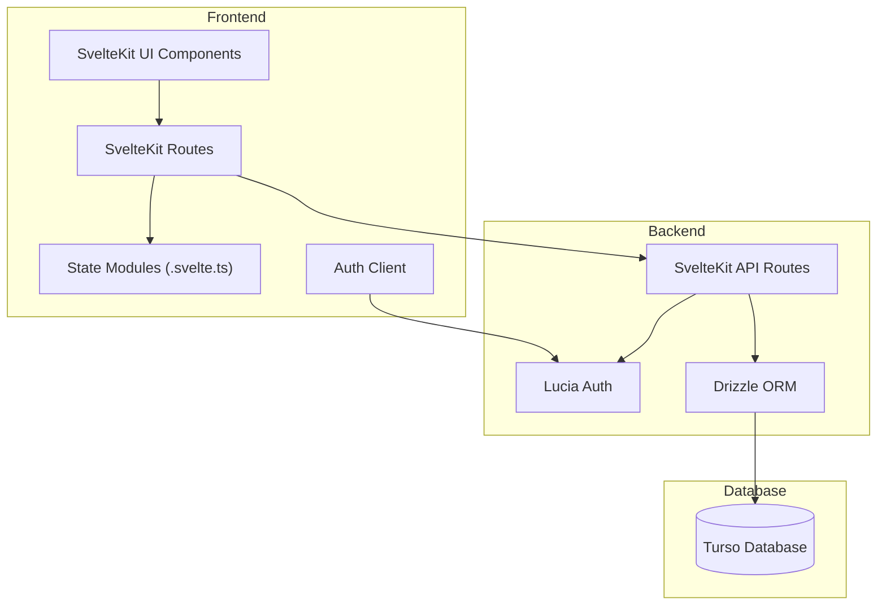
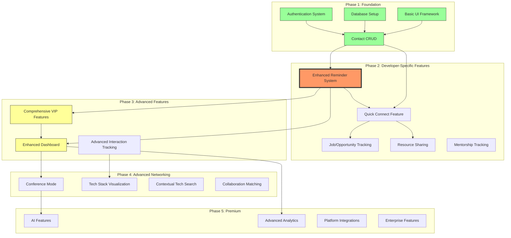

# Developer Hub CRM Plan - Connect, Relate, Meet

## Architecture Overview



## Key Components

1. **Database Layer**

   - Turso for distributed SQLite database
   - Drizzle ORM for type-safe database operations
   - Schema management with Drizzle migrations
   - Efficient query building with Drizzle's fluent API

2. **Authentication System**

   - Lucia authentication library
   - Argon2 for secure password hashing
   - Session-based authentication with cookies
   - CSRF protection
   - Role-based access control

3. **Frontend Architecture**

   - SvelteKit with Svelte 5 runes
   - Modern state management with class-based .svelte.ts files
   - Tailwind v4 for styling (CSS-first approach)
   - DaisyUI v5 for UI components
   - Responsive design for mobile and desktop
   - Dark/light mode support

4. **API Layer**
   - SvelteKit form actions for secure server operations
   - Type-safe request/response handling
   - Error handling and validation
   - Rate limiting

## Core Application Focus

The Developer Hub CRM focuses on two key aspects:

1. **Reminding developers to maintain contact with important
   people** - Ensuring you never lose touch with valuable connections
2. **Being easy to update and maintain** - Reducing friction to make
   the application genuinely useful

## Developer-Centric Use Cases

1. **Professional Networking Management**

   - Track contacts from conferences, meetups, and workplaces
   - Categorize by industry, skills, and relationship type
   - Set custom follow-up schedules based on relationship importance

2. **Project and Client Tracking**

   - Manage freelance clients and project statuses
   - Track communication history with clients
   - Set reminders for project milestones and payments

3. **Knowledge and Resource Sharing**

   - Record resources shared with contacts
   - Track mentorship relationships and progress
   - Document learning from interactions

4. **Career and Job Opportunity Management**

   - Track job applications, interviews, and recruiters
   - Store portfolio sharing history
   - Set follow-up reminders for opportunities

5. **Content Creation and Collaboration**
   - Manage collaborators for blogs, podcasts, or open source projects
   - Track audience feedback
   - Set reminders for content collaborations

## Data Model

### Core Entities

#### Users

- `id` (TEXT, PRIMARY KEY)
- `username` (TEXT, UNIQUE)
- `password_hash` (TEXT)
- `created_at` (TIMESTAMP_MS)
- `updated_at` (TIMESTAMP_MS)

#### Sessions

- `id` (TEXT, PRIMARY KEY)
- `user_id` (TEXT, FOREIGN KEY)
- `expires_at` (TIMESTAMP_MS)

#### Contacts

- `id` (TEXT, PRIMARY KEY)
- `user_id` (TEXT, FOREIGN KEY)
- `name` (TEXT)
- `relationship` (TEXT)
- `birthday` (TIMESTAMP_MS, nullable)
- `industry` (TEXT)
- `location` (TEXT, nullable)
- `vip` (BOOLEAN)
- `last_update` (TIMESTAMP_MS)
- `last_contacted` (TIMESTAMP_MS, nullable)
- `status` (TEXT)
- `created_at` (TIMESTAMP_MS)
- `updated_at` (TIMESTAMP_MS)

#### Interactions

- `id` (TEXT, PRIMARY KEY)
- `contact_id` (TEXT, FOREIGN KEY)
- `type` (TEXT)
- `date` (TIMESTAMP_MS)
- `notes` (TEXT, nullable)
- `transcript_source` (TEXT, nullable)
- `ai_suggestions` (TEXT, nullable)
- `confidence` (INTEGER, nullable)
- `created_at` (TIMESTAMP_MS)
- `updated_at` (TIMESTAMP_MS)

#### Background (VIP Info)

- `id` (TEXT, PRIMARY KEY)
- `contact_id` (TEXT, FOREIGN KEY)
- `family` (TEXT, nullable)
- `company` (TEXT, nullable)
- `likes_dislikes` (TEXT, nullable)
- `misc_notes` (TEXT, nullable)
- `created_at` (TIMESTAMP_MS)
- `updated_at` (TIMESTAMP_MS)

#### Contact Info (VIP Info)

- `id` (TEXT, PRIMARY KEY)
- `contact_id` (TEXT, FOREIGN KEY)
- `main_app` (TEXT, nullable)
- `email` (TEXT, nullable)
- `phone_number` (TEXT, nullable)
- `social_links` (TEXT, nullable)
- `created_at` (TIMESTAMP_MS)
- `updated_at` (TIMESTAMP_MS)

## Implementation Plan

### Phase 1: Foundation

1. **Project Setup**

   - Initialize SvelteKit project
   - Configure Tailwind v4 and DaisyUI v5
   - Set up Turso database connection
   - Configure Drizzle ORM for database operations
   - Implement base layout and navigation

2. **Authentication System**
   - Implement user registration and login with Lucia
   - Set up session-based authentication
   - Configure Argon2 for secure password hashing
   - Develop session management with cookies
   - Add authentication guards for routes

### Phase 2: Developer-Specific Enhancements

- **Enhanced Reminder System**: Status tracking and customizable
  follow-ups
- **Quick Connect Feature**: QR code generation and GitHub profile
  prefilling
- Job and opportunity tracking
- Resource sharing tracking
- Mentorship tracking

### Phase 3: Advanced Features

- Comprehensive VIP features
- Enhanced dashboard with real-time data
- Advanced interaction tracking

### Phase 4: Advanced Networking Features

- Conference mode and event-based organization
- Tech stack visualization
- Contextual search by technology
- Collaboration matching algorithm
- Technical discussion note taking

### Phase 5: Premium Features

- AI-powered features (as a paid tier)
- Advanced analytics
- Integration with additional developer platforms
- Enterprise features

## Updated Next Steps

1. **Enhance Reminder System** (Highest Priority):

   - Implement specialized status tracking system for developer
     relationships
   - Create customizable follow-up reminders with timing preferences
   - Add visual status indicators throughout the UI
   - Develop automated status updates based on interaction history
   - Implement dashboard widget showing contacts needing attention
   - Add UI for setting per-contact follow-up frequency and importance
     level
   - Create analytics for relationship health

   > _Why highest priority: The reminder system is the core
   > functionality of any CRM - maintaining relationships over time.
   > It addresses the primary purpose of "ensuring developers never
   > lose touch with valuable connections" and provides immediate
   > value for existing contacts. This feature leverages the existing
   > schema (`status` and `last_contacted` fields) and forms the
   > foundation for other advanced features._

2. **Complete VIP Features** (High Priority):

   - Add UI for editing background information
   - Add UI for editing contact information
   - Implement comprehensive VIP dashboard
   - Add VIP activation/deactivation with data preservation

   > _Why high priority: The VIP feature is partially implemented with
   > the database schema and basic display, making it a logical next
   > step. Completing this feature will provide immediate value for
   > managing important contacts._

3. **Enhance the Dashboard** (High Priority):

   - Replace mock data with real data
   - Add contact status visualization
   - Add recent interactions display
   - Add VIP quick access
   - Create developer-specific insights widgets

   > _Why high priority: The dashboard is the main entry point for
   > users and currently uses mock data. Enhancing it with real data
   > will significantly improve the user experience._

4. **Implement Quick Connect Feature** (Medium Priority):

   - Create QR code generation with configurable context (event name,
     location, session)
   - Implement QR code expiration mechanism (default: 24 hours)
   - Build web form with privacy notice and GitHub integration
   - Create token validation and storage system
   - Develop notification for new contacts added through Quick Connect
   - Add automatic context tagging for contacts based on QR code
     configuration

   > _Why medium priority: While valuable, this feature requires more
   > new development compared to enhancing existing features._

5. **Complete Interaction Tracking System** (Medium Priority):

   - Add more interaction types (project milestones, interviews, etc.)
   - Implement interaction filtering and search
   - Add interaction analytics and insights
   - Implement custom interaction types

   > _Why medium priority: Basic interaction tracking is already
   > implemented, these are enhancements._

6. **Implement Stripe Integration** (Lower Priority):

   - Research and document Stripe integration requirements
   - Implement subscription management
   - Create premium feature gating
   - Add payment history and invoice management

   > _Why lower priority: This is needed for monetization but not
   > essential for core functionality._

7. **Implement Developer-Focused Features** (Lower Priority):

   - Add job tracking functionality for interviews and opportunities
   - Implement resource sharing tracking
   - Create mentorship relationship tracking
   - Add content creation collaboration tracking

   > _Why lower priority: These are specialized features that build on
   > the core functionality._

8. **Implement AI Features** (Lowest Priority):

   - Speech-to-text form filling
   - Smart suggestions for follow-ups
   - Confidence scoring for AI suggestions
   - AI-assisted note summarization

   > _Why lowest priority: These are premium features that depend on
   > core functionality being complete._

## Feature Roadmap

The development of Developer Hub CRM will proceed in phases:



### Phase 1: Core Functionality (Current)

- Basic contact management
- Interaction tracking
- VIP designation
- User authentication

### Phase 2: Developer-Specific Enhancements

- **Enhanced Reminder System**: Status tracking and customizable
  follow-ups
- **Quick Connect Feature**: QR code generation and GitHub profile
  prefilling
- Job and opportunity tracking
- Resource sharing tracking
- Mentorship tracking

### Phase 3: Advanced Features

- Comprehensive VIP features
- Enhanced dashboard with real-time data
- Advanced interaction tracking

### Phase 4: Advanced Networking Features

- Conference mode and event-based organization
- Tech stack visualization
- Contextual search by technology
- Collaboration matching algorithm
- Technical discussion note taking

### Phase 5: Premium Features

- AI-powered features (as a paid tier)
- Advanced analytics
- Integration with additional developer platforms
- Enterprise features

## Technical Approach

### Database Access

Using Drizzle ORM for type-safe database operations:

```typescript
// src/lib/server/db/index.ts
import { createClient } from 'drizzle-orm';

const client = createClient({
	url: process.env.DATABASE_URL || 'file:local.db',
});

export async function query<T>(
	sql: string,
	params: Record<string, any> = {},
): Promise<T[]> {
	return client.execute(sql, params);
}
```

### Authentication

Using Lucia for authentication:

```typescript
// src/lib/server/auth.ts
import { lucia } from 'lucia';
import { sveltekit } from 'lucia/middleware';
import { turso } from '@lucia-auth/adapter-turso';
import { client } from '$lib/server/db';

export const auth = lucia({
	adapter: turso(client, {
		user: 'user',
		session: 'session',
	}),
	env: import.meta.env.DEV ? 'DEV' : 'PROD',
	middleware: sveltekit(),
	getUserAttributes: (data) => {
		return {
			username: data.username,
		};
	},
});

export type Auth = typeof auth;
```

## Documentation Needs

### Missing Documentation

1. **Stripe Integration Documentation**:

   - No documentation exists for Stripe integration
   - Need to create comprehensive guide covering:
     - API key setup and environment configuration
     - Subscription plan creation and management
     - Payment processing workflow
     - Webhook handling for subscription events
     - Testing procedures

2. **Reminder System Implementation Documentation**:

   - While a detailed guide exists in
     `docs/reminder-system-implementation-guide.md`, the actual
     implementation is missing
   - Documentation should be updated to reflect the actual
     implementation once completed

3. **API Documentation**:
   - No documentation for the API endpoints
   - Need to document all form actions and their parameters
   - Authentication requirements for each endpoint

### Documentation Updates Needed

1. **Update VIP Features Documentation**:

   - Current documentation in `docs/vip-features-explanation.md` needs
     to be updated to reflect the actual implementation status
   - Add implementation details once the feature is completed

2. **Update Quick Connect Documentation**:
   - Current documentation in `docs/quick-connect-implementation.md`
     is comprehensive but the feature is not implemented
   - Should be updated with actual implementation details once
     completed

### State Management

Using Svelte 5 runes for reactive state:

```typescript
// src/lib/state/contacts.svelte.ts
class ContactState {
	contacts = $state.raw([]);
	loading = $state(false);
	error = $state<string | null>(null);
}

export const contactState = new ContactState();
```

## Current Project Status

### Completed Features

- **Authentication System**

  - User registration and login with Lucia patterns
  - Session-based authentication with cookies
  - Password hashing with Argon2
  - Authentication guards for protected routes

- **Basic Contact Management**

  - CRUD operations for contacts
  - Contact listing with search and filtering
  - Contact detail view
  - Responsive layout with DaisyUI

- **Interaction Tracking**

  - Adding and deleting interactions with contacts
  - Tracking interaction history
  - Updating last contacted date

- **State Management**
  - Svelte 5 runes for reactive state
  - Context-based state management for contacts
  - Optimistic UI updates for contacts

### Partially Implemented Features

- **VIP Designation**

  - Marking contacts as VIP
  - Database schema for VIP-specific information (background and
    contact_info tables)
  - Basic VIP information display in contact detail view
  - ❌ Missing: UI for editing VIP information
  - ❌ Missing: Comprehensive VIP dashboard

- **Dashboard**
  - Basic dashboard layout
  - Contact statistics (total and VIP counts)
  - ❌ Missing: Real data for recent activity and upcoming tasks
  - ❌ Missing: Reminder widget

### Missing Features

- **Reminder System**

  - ❌ No implementation of the enhanced reminder system
  - ❌ Status field exists in schema but not used for reminders
  - ❌ No follow-up frequency settings
  - ❌ No automated status updates based on last contacted date

- **Quick Connect Feature**

  - ❌ No implementation of QR code generation
  - ❌ No web form for new contacts to fill out
  - ❌ No GitHub profile integration

- **Stripe Integration**

  - ❌ No implementation or documentation for Stripe payments
  - ❌ No premium features or subscription management

- **Other Missing Components**
  - ❌ Offline capabilities
  - ❌ Progressive enhancement
  - ❌ Integration tests
  - ❌ E2E tests with Playwright

## Implementation Strategy

### Short-term Implementation Plan (Next 2-4 Weeks)

1. **Week 1-2: Reminder System Implementation**

   - Extend the contact schema to add follow-up frequency and
     importance level fields
   - Implement status update service to automatically update contact
     statuses
   - Create UI components for setting follow-up preferences
   - Add dashboard widget for contacts needing attention
   - Implement visual status indicators throughout the UI

2. **Week 3-4: VIP Features Completion**
   - Create forms for editing background information
   - Implement contact info editing UI
   - Build VIP dashboard view
   - Add VIP activation/deactivation functionality

### Medium-term Implementation Plan (1-3 Months)

1. **Month 2: Dashboard Enhancement and Quick Connect**

   - Replace mock data with real data in dashboard
   - Implement recent activity tracking
   - Create QR code generation functionality
   - Build web form for Quick Connect
   - Implement GitHub profile integration

2. **Month 3: Interaction Enhancements and Stripe Research**
   - Add more interaction types
   - Implement interaction filtering and search
   - Research Stripe integration requirements
   - Create documentation for Stripe integration

### Long-term Implementation Plan (3+ Months)

1. **Months 4-5: Stripe Integration and Developer-Focused Features**

   - Implement Stripe subscription management
   - Add premium feature gating
   - Develop job tracking functionality
   - Implement resource sharing tracking

2. **Months 6+: AI Features and Advanced Networking**
   - Implement speech-to-text form filling
   - Add smart suggestions for follow-ups
   - Create conference mode
   - Develop tech stack visualization

## Summary and Conclusion

The Developer Hub CRM project has made significant progress in
establishing a solid foundation with authentication, basic contact
management, interaction tracking, and state management. The database
schema is well-designed and includes support for planned features like
VIP contacts and the reminder system.

### Current Position

We are currently at the end of Phase 1 (Foundation) and beginning
Phase 2 (Developer-Specific Enhancements). The core functionality is
in place, but the key differentiating features that make this a
developer-focused CRM are still pending implementation.

### Critical Path Forward

1. The reminder system is the highest priority as it addresses the
   core purpose of the CRM: "ensuring developers never lose touch with
   valuable connections."

2. Completing the VIP features and enhancing the dashboard will
   provide immediate value to users while building on existing partial
   implementations.

3. Documentation for Stripe integration needs to be created before
   implementation begins, as this is a complex feature that requires
   careful planning.

### Recommendations

1. **Focus on Core Value Proposition**: Prioritize the reminder system
   implementation to deliver the core value proposition of the CRM.

2. **Build on Existing Work**: Complete partially implemented features
   (VIP, Dashboard) before starting entirely new features.

3. **Document as You Build**: Update documentation for each feature as
   it's implemented to ensure it stays in sync with the actual code.

4. **Implement in Phases**: Follow the implementation strategy to
   ensure steady progress and regular delivery of value to users.

5. **Test Early and Often**: Add tests for each feature as it's
   implemented to ensure reliability and maintainability.

By following this plan, the Developer Hub CRM will evolve into a
powerful tool specifically designed for developers' networking needs,
with a focus on maintaining valuable professional relationships over
time.
